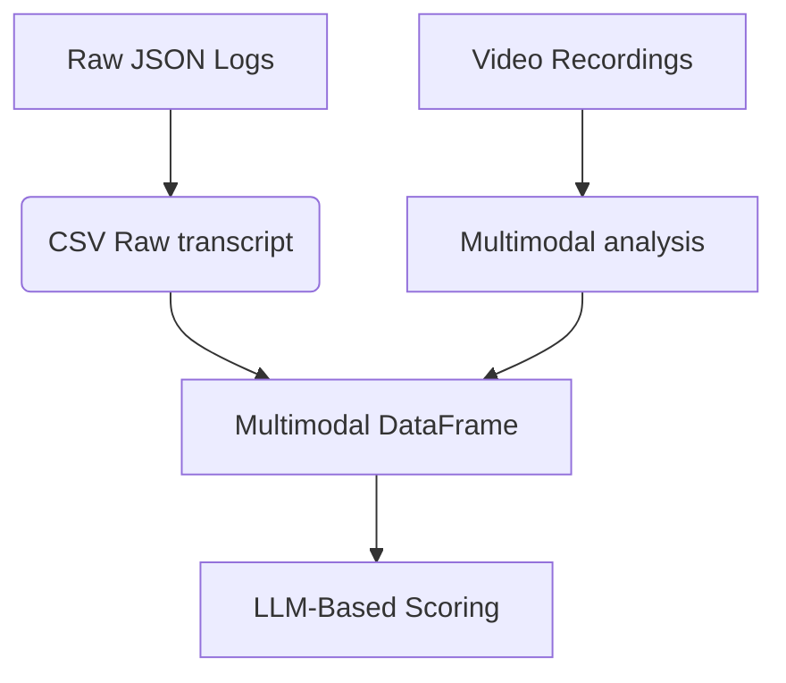

# [CHART ASIST: Team Coordination Analysis](https://somwrks.notion.site/CHART-ASIST-161e4acf846e8024823ceb2e1bd9a278?pvs=4)

*Repository for analyzing human-AI team coordination in Minecraft-based search-and-rescue tasks.*

---

## 📂 Repository Structure

```
CHART_ASIST/  
├── .venv/                  # Python virtual environment (dependencies)
├── data/               # Raw datasets (JSON logs, surveys, videos)
├── processed/          # Cleaned data and analysis outputs
├── scripts/            # Jupyter notebooks and Python scripts
└── README.md           # Detailed project documentation
```

---

## 🚀 Getting Started

1. **Clone this repository**:

   ```bash
   git clone https://github.com/yourusername/CHART-ASIST.git
   cd CHART-ASIST
   ```
2. **Set up the virtual environment**:

   ```bash
   source .venv/bin/activate  # Linux/WSL
   # .venv\Scripts\activate  # Windows
   ```
3. **Follow detailed instructions** in [Study3_Analysis/README.md](Study3_Analysis/README.md) for:

   - Data preprocessing
   - Statistical analysis
   - Visualization workflows

---

## 🔍 Key Components

| Folder/File | Purpose                                                                       |
| ----------- | ----------------------------------------------------------------------------- |
| `.venv/`  | Contains Python dependencies (`opencv-python`, `pandas`, `scipy`, etc.) |
| `/`       | Main analysis workflows (Jupyter notebooks, data, results)                    |
| `data`    | Raw datasets from ASIST Study 3 (JSON logs, SPSS surveys, videos)             |

---

## 🛠 Requirements

- Python 3.10
- WSL (Windows Subsystem for Linux) recommended for Linux-like environment
- Jupyter Lab for interactive analysis

---

## 📈 Analysis Workflow

1. **Data Parsing**Convert raw JSON/SPSS/VTT files to structured CSVs.
2. **Multi-Modal Analysis**Correlate AI advice patterns (`advice_type`, `timestamp`) with team outcomes (`game_score`).
3. **Visualization**
   Generate plots showing relationships between variables (e.g., Seaborn boxplots).

---

# ASIST Study 3: Multi-Modal Analysis of AI-Human Team Coordination

## 📜 Table of Contents

- [Dataset Overview](#-dataset-overview)
- [Research Context](#-research-context)
- [Methodological Framework](#-methodological-framework)
- [Data Dictionary](#-data-dictionary)
- [Analysis Workflow](#-analysis-workflow)
- [Ethical Considerations](#-ethical-considerations)
- [Getting Started](#-getting-started)
- [Contributing](#-contributing)
- [License](#-license)

## 🌐 Dataset Overview

**Original Source**: CHART ASIST Study 3 Dataset from [ASU Dataverse](https://dataverse.asu.edu/dataset.xhtml?persistentId=doi:10.48349/ASU/QDQ4MH)
**Subset Characteristics**:

```
{
    "team_id": "000286",
    "asi_id": "ASI-CMURI-TA1",
    "trial": "T000829",
    "intervention_recipients": ["E001211", "E001215", "E001155"],
    "modalities": ["behavior_logs", "video", "chat_transcripts"],
    "time_range": "2025-02-15T11:23:01 to 2025-02-15T22:03:00"
}
```

## 🔍 Research Context

This study examines **Artificial Social Intelligence (ASI)** interventions in a Minecraft-based urban search-and-rescue simulation. Key research questions:

1. How do ASI advisory signals impact team coordination dynamics?
2. What multimodal signatures predict successful human-AI collaboration?
3. Can LLM-based analysis pipelines accurately quantify team performance?

**Theoretical Framework**: Joint Activity Theory (JAT) applied to human-AI teams

## 🧪 Methodological Framework

### Multi-Modal Data Fusion Pipeline




### Key Technical Components

1. **Computer Vision Module**

   - Gemini Multimodal-based agent tracking
   - Room localization segmentation

   ```
   def detect_agents(frame):
       model = gemini2.0
       results = model(frame)
       return parse_detections(results)
   ```
2. **Natural Language Processing**

   - Gpt4o sentiment analysis
   - Dialogue act classification

   ```
   nlp = pipeline('sentiment-analysis', model='gpt4o')
   df['sentiment'] = df['message'].apply(lambda x: nlp(x[:512])['label'])
   ```
3. **Temporal Alignment**

   - Dynamic time warping for multimodal synchronization

   $$
   DTW(P,Q) = \min_{W} \sum_{k=1}^{K} w_k
   $$

## 📊 Data Dictionary

### Core DataFrame Schema

| Column               | Type        | Description                              | Example                                                                     |
| -------------------- | ----------- | ---------------------------------------- | --------------------------------------------------------------------------- |
| `timestamp`        | DateTime    | ISO 8601 formatted event time            | 2025-02-15T11:23:01                                                         |
| `asi_action_class` | Categorical | ASI intervention type per DARPA taxonomy | RemindTransporterBeep                                                       |
| `agent_states`     | JSON        | Multimodal state vector                  | `{"location": "B4", "activity": "victim_transport", "tool": "stretcher"}` |
| `team_score`       | Float [0-1] | Normalized performance metric            | 0.67                                                                        |
| `asi_advice_score` | Float [0-1] | Intervention effectiveness rating        | 0.82                                                                        |

## ⚙️ Analysis Workflow

### Step 1: Data Preprocessing

```
# Install dependencies
pip install -r requirements.txt

# Convert raw logs
python preprocess.py --input_dir ./raw_data --output ./processed/logs.csv
```

### Step 2: Multimodal Feature Extraction

```
from asist.analysis import MultimodalIntegrator

integrator = MultimodalIntegrator(
    video_path="trial_000286.mp4",
    transcript_path="transcript.csv"
)
df = integrator.generate_timeline()
```

### Step 3: LLM-Based Scoring

```
from asist.scoring import TeamworkEvaluator

evaluator = TeamworkEvaluator(model="gpt-4o")
scores = evaluator.analyze_dataframe(df)
```

## 🛠️ Getting Started

### Recommended Environment

- Python 3.10+
- CUDA 11.8 (GPU acceleration recommended)
- 16GB RAM

## Manual Dataframe

Timestamp, AI Message, AI Action Class, Transporter Message, Engineer Message, Medic Message is extracted from transcript.csv

We use Multimodal LLM analysis to analyze video data to give states and locations of agents + victims throughout the experiment


| Time Stamp (Transcript) | Asi Message (Transcript) | Asi Action Class (Transcript) | Transporter Message (Transcript) | Engineer Message (Transcript) | Medic Message (Transcript) |
| ----------------------- | ------------------------ | ----------------------------- | ------------------------------- | ----------------------------- | -------------------------- |
| 11:23:01                | N/A                      | N/A                           | N/A                             | N/A                           | N/A                        |

## llmv1 Dataframe

States tells us what the agent is doing
Locations tells use where the agent is located in the map

States and locations are fused together using LLM analysis to form one action_state column signifying their role in a situation

| timestamp (Transcript) | asi_reason (Transcript) | asi_action (Transcript) | transporter_message (Transcript) | engineer_message (Transcript) | medic_message (Transcript) | transporter_action_state (LLM) | engineer_action_state (LLM) | medic_action_state (LLM) | victim_location (LLM) | 
| --------- | --------- | --------- | ------------------ | --------------- | ------------ | --------------- | --------------- | ------------ | --------------- |
|           |           |           |                    |                 |              |                 |                 |              |                 |


We then utilize another LLM to finally provide ASI Advice score and team score for their actions and LLM's reasoning behiind that

## llmv2 Dataframe
| timestamp (Transcript) | asi_reason (Transcript) | asi_action (Transcript) | transporter_message (Transcript) | engineer_message (Transcript) | medic_message (Transcript) | transporter_action_state (LLM) | engineer_action_state (LLM) | medic_action_state (LLM) | victim_location (LLM) | team_score (LLM) | asi_advice_score (LLM) | team_score_reason (LLM) | asi_advice_score_reason (LLM)
| --------- | --------- | --------- | ------------------ | --------------- | ------------ | --------------- | ---------- | --------------- | --------------- |--------------- |--------------- | --------------- | --------------- |
|     22:03      |   You guys should do [asi_action_class] because...        | 1. RemindTransporterBeep <br/>2. InformAboutTriagedVictim <br/>3. RemindMedicToInformAboutTriagedVicti <br/>4. TriageCriticalVictim <br/>5. EvacuateCriticalVictim <br/>6.EncouragePlayerProximityToMedicIHMCDyad <br/>7. RemindChangeMarke <br/>8. RemindRubblePerturbatio <br/>9. EvacuationZoneDistanc <br/>10. TeamSawVictimMarke <br/>11. TimeElapse <br/>12. StartEvacuatio|     I'm coming for you medic               |     This is more important               |     I can't help you!               |     Carrying a victim from b4 to g4 room               |     Clearing rubbles in threat room for medic  at a9 room          |     waking up critical victim at g5 room        |    next to medic, far from engineer, close to transporter            |  40%          |     75%           | team was inconsistent with their tasks, especially... | asi's advice is particularly useful because... |


## AI Instruct Modal

We finetune pretrained LLM on our data for understanding minecraft test bed for asist thoroughly and deeply. Then we utilize it to perform-

1. **Multimodal DataAnalysis of Video Data** 

To give information about agent locations and their actions

2. **Text Fusion Data Analysis**

To fuse meanings and relationships between agent communication, their location and state in given situations to a single column

3. **Scoring Analysis**

To score humans and ASI's advice on team work communication and collaboration data   

