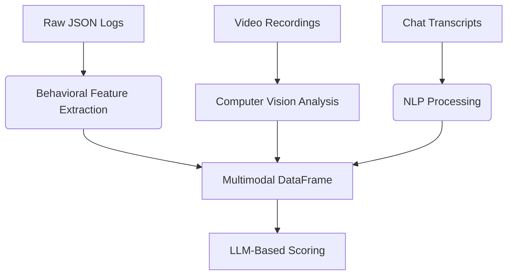

Here# ASIST Study 3: Multi-Modal Analysis of AI-Human Team Coordination [](https://doi.org/10.xxxx/zenodo.xxxxxx)

## 📜 Table of Contents
- [Dataset Overview](#-dataset-overview)
- [Research Context](#-research-context)
- [Methodological Framework](#-methodological-framework)
- [Data Dictionary](#-data-dictionary)
- [Analysis Workflow](#-analysis-workflow)  
- [Ethical Considerations](#-ethical-considerations)
- [Getting Started](#-getting-started)
- [Contributing](#-contributing)
- [License](#-license)

## 🌐 Dataset Overview
**Original Source**: CHART ASIST Study 3 Dataset from [ASU Dataverse](https://dataverse.asu.edu/dataset.xhtml?persistentId=doi:10.48349/ASU/QDQ4MH)  
**Subset Characteristics**:
```
{
    "team_id": "000315",
    "asi_id": "ASI-CMURI-TA1",
    "trial": "T000829",
    "intervention_recipients": ["E001211", "E001215", "E001155"],
    "modalities": ["behavior_logs", "video", "chat_transcripts"],
    "time_range": "2025-02-15T11:23:01 to 2025-02-15T22:03:00"
}
```

## 🔍 Research Context
This study examines **Artificial Social Intelligence (ASI)** interventions in a Minecraft-based urban search-and-rescue simulation. Key research questions:

1. How do ASI advisory signals impact team coordination dynamics?
2. What multimodal signatures predict successful human-AI collaboration?
3. Can LLM-based analysis pipelines accurately quantify team performance?

**Theoretical Framework**: Joint Activity Theory (JAT) applied to human-AI teams

## 🧪 Methodological Framework
### Multi-Modal Data Fusion Pipeline


### Key Technical Components
1. **Computer Vision Module**
   - OpenCV-based agent tracking
   - Room localization using YOLOv8 segmentation
   ```
   def detect_agents(frame):
       model = YOLO('asist_v8n.pt') 
       results = model(frame)
       return parse_detections(results)
   ```

2. **Natural Language Processing**
   - BERT-based sentiment analysis
   - Dialogue act classification
   ```
   nlp = pipeline('sentiment-analysis', model='distilbert-base-uncased')
   df['sentiment'] = df['message'].apply(lambda x: nlp(x[:512])['label'])
   ```

3. **Temporal Alignment**
   - Dynamic time warping for multimodal synchronization
   $$ DTW(P,Q) = \min_{W} \sum_{k=1}^{K} w_k $$

## 📊 Data Dictionary
### Core DataFrame Schema
| Column | Type | Description | Example |
|--------|------|-------------|---------|
| `timestamp` | DateTime | ISO 8601 formatted event time | 2025-02-15T11:23:01 |
| `asi_action_class` | Categorical | ASI intervention type per DARPA taxonomy | RemindTransporterBeep |
| `agent_states` | JSON | Multimodal state vector | `{"location": "B4", "activity": "victim_transport", "tool": "stretcher"}` |
| `team_score` | Float [0-1] | Normalized performance metric | 0.67 |
| `asi_advice_score` | Float [0-1] | Intervention effectiveness rating | 0.82 |

## ⚙️ Analysis Workflow
### Step 1: Data Preprocessing
```
# Install dependencies
pip install -r requirements.txt

# Convert raw logs
python preprocess.py --input_dir ./raw_data --output ./processed/logs.csv
```

### Step 2: Multimodal Feature Extraction
```
from asist.analysis import MultimodalIntegrator

integrator = MultimodalIntegrator(
    video_path="trial_000315.mp4",
    transcript_path="transcript.csv"
)
df = integrator.generate_timeline()
```

### Step 3: LLM-Based Scoring
```
from asist.scoring import TeamworkEvaluator

evaluator = TeamworkEvaluator(model="gpt-4-turbo")
scores = evaluator.analyze_dataframe(df)
```

## 🛠️ Getting Started
### Recommended Environment
- Python 3.10+
- CUDA 11.8 (GPU acceleration recommended)
- 32GB RAM


## V1 Dataframe

Timestamp, AI Message, AI Action Class, Transporter Message, Engineer Message, Medic Message is extracted from transcript.csv

We use Multimodal LLM analysis to analyze video data to give states and locations of agents + victims throughout the experiment

States tells us what the agent is doing
Locations tells use where the agent is located in the map

| Time Stamp | Asi Message | Asi Action Class | Transporter Message | Engineer Message | Medic Message | Transporter State | Engineer State | Medic State | Transporter location | Engineer location | Medic location | Victim Location |
| ---------- | ----------- | ---------------- | ------------------- | ---------------- | ------------- | ----------------- | -------------- | ----------- | -------------------- | ----------------- | -------------- | --------------- |
| 11:23:01   | N/A         | N/A              | N/A                 | N/A              | N/A           | N/A               | N/A            | N/A         | N/A                  | N/A               | N/A            | N/A             |

## Final Dataframe

States and locations are fused together using LLM analysis to form one action_state column signifying their role in a situation

| timestamp | asi_reason | asi_action | transporter_message | engineer_message | medic_message | transporter_action_state | engineer_action_state | medic_action_state | victim_location | 
| --------- | --------- | --------- | ------------------ | --------------- | ------------ | --------------- | --------------- | ------------ | --------------- |
|           |           |           |                    |                 |              |                 |                 |              |                 |


We then utilize another LLM to finally provide ASI Advice score and team score for their actions and LLM's reasoning behind that

| timestamp | asi_reason | asi_action | transporter_message | engineer_message | medic_message | transporter_action_state | engineer_action_state | medic_action_state | victim_location | team_score | asi_advice_score |
| --------- | --------- | --------- | ------------------ | --------------- | ------------ | --------------- | ---------- | --------------- | --------------- |--------------- |--------------- |
|     22:03      |   You guys should do [asi_action_class] because...        | 1. RemindTransporterBeep <br/>2. InformAboutTriagedVictim <br/>3. RemindMedicToInformAboutTriagedVicti <br/>4. TriageCriticalVictim <br/>5. EvacuateCriticalVictim <br/>6.EncouragePlayerProximityToMedicIHMCDyad <br/>7. RemindChangeMarke <br/>8. RemindRubblePerturbatio <br/>9. EvacuationZoneDistanc <br/>10. TeamSawVictimMarke <br/>11. TimeElapse <br/>12. StartEvacuatio|     I'm coming for you medic               |     This is more important               |     I can't help you!               |     Carrying a victim from b4 to g4 room               |     Clearing rubbles in threat room for medic  at a9 room          |     waking up critical victim at g5 room        |    next to medic, far from engineer, close to transporter            |  40%          |     75%           |


## AI Instruct Modal

We finetune pretrained LLM on our data for understanding minecraft test bed for asist thoroughly and deeply. Then we utilize it to perform-

1. **Multimodal DataAnalysis of Video Data**

To give information about agent locations and their actions

2. **Text Fusion Data Analysis**

To fuse meanings and relationships between agent communication, their location and state in given situations to a single column

3. **Scoring Analysis**

To score humans and ASI's advice on team work communication and collaboration data
